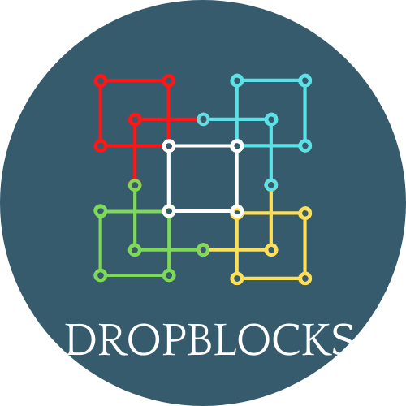
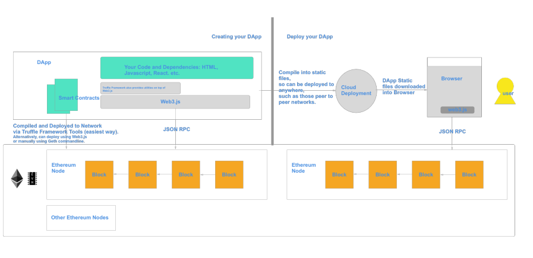
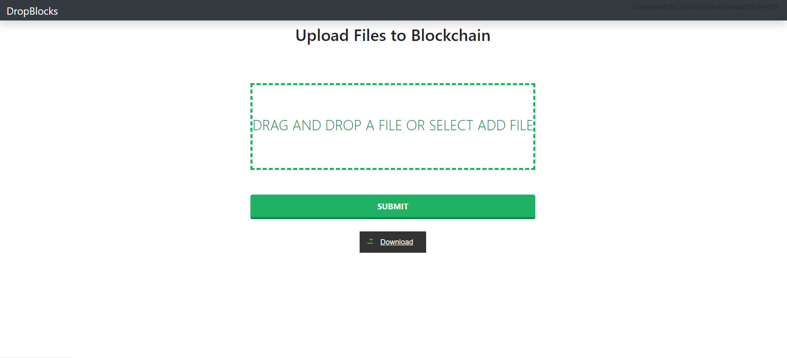

<h1>Drop-Blocks</h1> 
<h4>This is an Web-Application which allows user to store their confidential files securely in the blockchain.</h4>

 <h2>Why BlockChain?</h2>
   <h4>The solution to make cloud storage faster and more secure is using blockchain. Blockchain is a database or ledger that is shared across a network. This ledger is encrypted such that only authorized parties can access the data. Since the data is shared, the records cannot be tampered.</h4>

<h2>Tech Stack</h2>
<h3>1. React JS</h3>
<h3>2. Solidity for smart contracts</h3>
<h3>3. Ganache & Metamask</h3>
<h3>4. IPFS</h3>
<h3>5. Ethereum Blockchain is backend for the application where files get stored</h3>

<h2>Sturcture</h2>

<h2>HomePage</h2>

<h2>Steps to install and run application : </h2> 
<h3>Enter following commands </h3>

<h4>1. npm install 
This will install all the dependencies required for the application to run</h4>

<h4>2. truffle test
You have to start Ganache on your PC and connect to your browser using Metamask 
After running this command connection is established and tested properly </h4>

<h4>3. npm start
This will start application on your localhost and you can check functionality of 
the application by uploading some files on it and then downloading them </h4>

<h2> Video link</h2>
Link - 1:
https://drive.google.com/file/d/1bo1_2o5YD6yiQsSpUEq73qXuCm2egtfW/view?usp=sharing

Link -2 :
https://youtu.be/_gE2pjYEikQ

